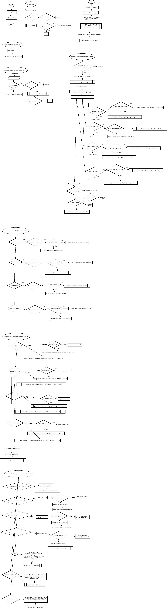

- [Single User Dungeon](#single-user-dungeon)
  * [How to play](#how-to-play)
  * [Features](#features)
  * [Existing Features](#existing-features)
  * [Future Features](#future-features)
  * [Data Model](#data-model)
  * [Wireframes Mockups and specification for the Game](#wireframes-mockups-and-specification-for-the-game)
  * [User interface flowchart](#user-interface-flowchart)
  * [Dungeon Coordinates Map](#dungeon-coordinates-map)
  * [Wireframes before game built](#wireframes-before-game-built)
  * [Testing](#testing)
    + [Tests Done](#tests-done)
  * [Deployment](#deployment)
  * [Credits](#credits)

<small><i><a href='http://ecotrust-canada.github.io/markdown-toc/'>Table of contents generated with markdown-toc</a></i></small>


# Single User Dungeon

This game is a Python terminal game. Which runs in a Game Institute mock terminal on Heroku.

Users can explore the game level by entering rooms and picking up weapons and health as they go.
They can also attack dragons 9 in total 3 big dragons and 6 little dragons.

The link to the Heroku applictaion is: https://my-dungeon-4d54eec58a64.herokuapp.com/
It should be noted that sometimes the application stalls which i think is a connection
problem with Heroku as it works in VSCode and when I open a Heroku console and type python3 run.py
it works. I think its todo with the number of connections allowed at once?

[Back to top](#)

## How to play

When the user loads the game they are first given the introduction screen where you are given some
briefs of the game with 3 options. 1 to play the game, 2 to view the readme on how to play the
game and 3 to exit the game. when the user chooses to play the game they are shown a Room list
and asked for a room number which they have to type and press enter then once in the room the
contents of the room is described at the upper area of the room menu which has options to go north
east west center and south/door exit.

If the player wants to cheat they can scroll up to the level plan which shows all rooms and entities
within the game level. This is handy for finding weapons and health by looking at the room floor plan.

typical instructions once in a room are Attack dragon or pickup health etc by pressing a number
in the menu list and pressing enter.

[Back to top](#)

## Features

## Existing Features

* Random level generation
    * The game level is generated then a script to choose a random room and random position with random entity from the listof_dragons_inrooms, listof_weapons_inrooms, listof_medipacks_inrooms combined to select a random entity from this list(listof_entities_inrooms) and in the random room the random entity is added to a random position north east west or center (remember south is the door) then this random entity is removed from the list listof_entities_inrooms so that entity of the 18 is used up and this algorithm continues till there is no more entities.
    * The player if the cheat sheet is not used then they have to roam the dungeon by entering rooms to get weapons and to kill dragons. A typical cheat sheet
    is shown below. It shows a floor plan and entities within it for easy viewing.

    

* Input validation and error checking
    * There is four validation scripts. Firstly the introduction screen has to be validated with 3 options and then once you choose to play the game a menu with the room number of the dungeon rooms list is shown and then the system has to validate input once entered a room. Where you can choose a direction with go direction, Attack dragon at direction, pickup entity at direction would be typical generic commands executed by choosing the option number and pressing enter.
    * All input screens show a list and a number to select an item in the list
    * Once an item is chosen the user inputs the number of the item and presses enter
    * the validation checks for valid number and a range of number for the appropiate menu and displays an error message if the number is out of range
    * Also if the user enters a character which is not a number the validation shows an error message and rerenders the input string.

* Menus
    * Introduction menu used for an introduction to the game and the goals of the game with a how to play option when number 2 is chosen and enter returned a screen which describes howto play the game is shown and if you press enter the how to play game screen is exited and the introduction menu is displayed again. If while here you choose 1 and press enter then you can go into the play game menu but if you choose option number 3 and press enter then the game is exited.

    

    * Dungeon Room listing. This menu is used to select which room the user wants to enter there is 12 rooms thus 12 options and number 13 for exit game.

    

    * Room listing. This menu is used once a user enters a room. It has some features for instance it has a message you have entered room (number) 1 for this case. It has a description of the room just under the line for the room number. In this case To the center of the room there is a little dragon. Directly under this it shows player health 100 and under this there is [] which shows you that the player has no weapons yet. When the player picks up a weapon the english description of the weapon is shown in this list. Under this is the menu options 1. go north, 2. go east, 3. go west, 4. attack little dragon to the center and 5. go south and exit room. if you enter a number and press enter a validation script is run and checks if its in range 1 to 5 and that the number is really a number otherwise a ValueError exception is thrown and you get a message say you have to enter a number between 1 and 5 please try again. This message and prompt for new input is shown directly under the current prompt.

        Note: That the description and the menu options vary dependant on the contents of the room.

    

    * Game over replay screen is used to display game over and to show the time the player was playing the game. it also allows the player to replay the game or to exit the game.

    

* A timer is used in this game in order to give some measure of play. When the player starts to play the game the timer is started and when the player is killed a Game Over the player was killed by Dragon message is displayed with the amount of time in seconds that the player lasted in the game and the play again message is displayed with the introduction menu options rendered again for the player to easily reenter the game.

* There is 9 dragons in this challenge dungeon 3 big dragons and 6 little dragons once the player kills all 9 then the game is over and a well done message is displayed and the time taken is shown in seconds and the introduction menu is rerendered for the option to play again.

[Back to top](#)

## Future Features

* I would have loved to make this game concept into an actual 2D game with a graphics library but that option was not feasible with Heroku.
* To have a quickest time score sheet.

[Back to top](#)

## Data Model
I used 2 classes in this project Room and Dungeon. The Room class is used within the Dungeon class as there is a list of Room objects. 12 in this case.

When the Dungeon class instance is instantiated the Dungeon constructor is called which call the create_rooms(number_of_rooms) method which creates the level then 3 lists are created in main to initialise the entities (listof_dragons_inrooms, listof_weapons_inrooms, listof_medipacks_inrooms) then these lists are passed to the dungeon object and the dungeon add_objects_to_rooms method where the level is populated with entities in random rooms at random positions and where the entities are randomly accessed. In this particular instance there is 18 entities 9 dragons, 3 shields ,3 swords and 3 medi packs


The major functions in code flow charts



[Back to top](#)

## Wireframes Mockups and specification for the Game

Spec for game

A Dungeon has a corridore and the corridore has rooms

The Dungeon has a Class Dungeon and a Room class

A Dungeon has 12 rooms

The level has 6 dragons and 3 big dragons
the big dragons require a big shield and a long sword to kill
The dragons are randomly generated in the rooms North, East, West, Center

you need a long sword to kill a big dragon and a sword to kill a little dragon
there is 3 powerups for swords in the level a sword and a long sword
There is 3 powerups for shields a little shield and a big shield
there is 3 health powerups.

if you attack a big dragon with a basic sword you are killed
if you attack a big dragon with a long sword and a small shield you win with 50% health loss
if you attack a big dragon with a long sword and you have a big shield you win with 100% health

if you attack a dragon with a basic sword you are killed
if you attack a dragon with a basic sword and a small shield you win with 50% health
if you attack a dragon with a basic sword and big shield you win with 75% health
if you attack dragon with with long sword and a basic shield you win with 85% health
if you attack dragon with long sword and big shield you win 100% health

The game has a normal mode which shows the plans of the building
and a cheat mode which shows the plans of the building and enemys and powerups by rooms

[Back to top](#)

## User interface flowchart


[Back to top](#)

## Dungeon Coordinates Map


[Back to top](#)

## Wireframes before game built
```
From flow chart Choice 1
********************************************************************************************
*                               Welcome to my Dungeon
*                               May you conquer and reap the benefits
*                               Enter the Rooms and slay the dragons
*                               Pickup health and weapons as you go
********************************************************************************************
*
*                               Menu
*                               Choose a Room to goto
********************************************************************************************
1. Room 1       2. Room 2
3. Room 3       4. Room 4
5. Room 5       6. Room 6
7. Room 7       8. Room 8
9. Room 9       10. Room 10
11. Room 11     12. Room 12
13. Exit game

******************************************************************************************
Choose: __
******************************************************************************************
```
```
From flowchart choice 2
if no powerups, weapons or dragons in the room
********************************************************************************************
*
*                           You have entered Room (number)
*                           choose an option
*
*********************************************************************************************
1. go north
2. go east
3. go west
4. goto middle of the room
5. exit room
*********************************************************************************************
Choose: __
*********************************************************************************************
```
```
if dragon in the room at north wall
********************************************************************************************
*
*                           You have entered Room (number)
*                           choose an option
*
*********************************************************************************************
1. go north to attack dragon
2. go east
3. go west
4. goto middle of the room
5. exit room
*********************************************************************************************
Choose: __
*********************************************************************************************
```
```
if powerups at the east wall
********************************************************************************************
*
*                           You have entered Room (number)
*                           choose an option
*
*********************************************************************************************
1. go north
2. go east to pickup powerups
3. go west
4. goto middle of the room
5. exit room
*********************************************************************************************
Choose: __
*********************************************************************************************
```
```
if weapons at west wall
********************************************************************************************
*
*                           You have entered Room (number)
*                           choose an option
*
*********************************************************************************************
1. go north
2. go east
3. go west to pickup small shield
4. goto middle of the room
5. exit room
*********************************************************************************************
Choose: __
*********************************************************************************************
```
```
if a dragon and weapons in the same room
********************************************************************************************
*
*                           You have entered Room (number)
*                           choose an option
*
*********************************************************************************************
1. go north to attack dragon
2. go east to pickup long sword
3. go west
4. goto middle of the room
5. exit room
*********************************************************************************************
Choose: __
*********************************************************************************************
```

[Back to top](#)

## Testing

I have manually tested this project by doing the following.

* Passed the code through the PEP8 linter and confirmed that there are no problems


[Back to top](#)

### Tests Done

Before I introduce you to the testing I need to describe the screens and show whats what!.

So screen 1


Screen 2


Screen 3


Typical Screen 4


Typical Screen 5


| Test | Description | Result | Expected | Notes |
| --- | --- | --- | --- | --- |
| On screen 1 number 2 was pressed and then the return key was pressed | Testing for how play game functionality on screen 1 | The screen was rendered| The screen was rendered | |
| On screen 1 11 was entered then the return key pressed| Testing for validation| Invalid choice displayed asking you to enter a number 1 to 3| result as expected | |
| On screen 1 cat was entered and the return key pressed| Testing for validation| Invalid choice displayed asking you to enter a number 1 to 3 | result as expected | |
| On screen 2 return was pressed and then return key pressed| Testing for exit of screen 2 | On return Screen 1 is rendered | On return screen 1 rendered| On Screen 2 anything can be entered but when the return is pressed then Screen 1 is rendered |
| On Screen 1 number 3 was pressed and then return key pressed| Testing for exit game | The Game ends| The game ends | |
| On Screen 1 number 1 was pressed and then return was pressed | Testing for entering game | Screen 3 is displayed | Screen 3 is displayed| |
| On Screen 3 a room number is pressed and then the return key is pressed | Testing for entering Screen 4 | Screen 4 Displayed | Screen 4 Displayed | |
| On Screen 3 200 was entered and the return key pressed| Testing for validation| Invalid choice displayed asking you to enter a number 1 to 13 | result as expected | |
| On Screen 3 cat was entered and return key pressed| Testing for validation | Invalid choice displayed asking you to enter a number 1 to 13 | result as expected | |
| On Screen 3 1 was entered and return key pressed | Testing for rendering Screen 4| Screen 4 rendered | result as expected | |
| On Screen 4 11 was entered and return key pressed| Testing for validation | Invalid choice is displayed asking you to enter a number 1 to 5 | result as expected | |
| On Screen 4 cat was entered and return key pressed| Testing for validation | Invalid choice displayed asking you to enter a number between 1 and 5 | result as expected | |
| On Screen 4 1 was entered and return pressed| Testing for go north | The player went north | result as expected | For this particular instance the Room is empty so there is nothing at the north wall|
| On Screen 4 2 was entered and return pressed| Testing for go east | The player went to the east wall | result as expected| For this particular instance there was nothing to the east wall |
| On Screen 4 3 was entered and return pressed | Testing for go west| The player went to the west wall | result as expected | For this particular instance the Room  was empty so there was nothing to the west wall |
| On Screen 4 4 was entered and return key pressed| Testing for go center| The player went to the center | result as expected | For this particular instance the Room was empty so there was nothing at the center of the Room |
| On Screen 4 5 was entered and return key pressed| Testing for exit Room | The player exited the Room and Screen 3 rendered | result as expected | |
| On Screen 3 2 was entered and return key pressed| Testing for enter Room 2| Screen 4 was rendered | result as expected | |
| On Screen 4 1 was ented and return key pressed| Testing for go north | The player went north| result as expected| On this game level when it was generated when you enter Screen 3 there is nothing to the north wall |
| On Screen 4 2 was entered and return key pressed| Testing for Pickup of little sword to the east | The little sword was picked up and the weapons list shows it| result as expected | On this level there was a little sword to the east Now the room is empty|
| On Screen 4 since the Room is now empty 5 was chosen to exit the Room| Testing for Screen 3 render after picking up a weapon| Screen 3 rendered | result as expected | |
| On Screen 3 3 was entered and return key pressed| Testing for entering Room 3 | Screen 4 rendered |  result as expected| |
| On Screen 4 There is an option to pickup long sword to the east so 2 was entered and return key pressed| Testing for pickup of long sword | long sword picked up and the weapons list shows it along with other weapons | result as expected | |
| On Screen 4 the Room 3 is now empty so choosing exit Room so 5 was entered and return key pressed| Testing for Screen 3 render from exit Room on Screen 4 | Room was exited | result as expected | |
| On Screen 3 4 was entered to enter Room 4 and return key pressed | Testing for entering Room 4| Screen 4 rendered for Room 4 | result as expected | |
| On Screen 4 Room 4 There is a dragon to the north so choosing to attack the dragon 1 entered and return key pressed| Testing for attack dragon functionality, notice the weapons in this case I have a little sword and a long sword| Game Over player killed by Dragon with a message showing this and time taken and the option to play again Screen 5 rerendered | result as expected | |
| On Screen 1 after a game over play game option 5 was entered and return key pressed| Testing for Screen 3 render| Screen 3 was rendered | result as expected | |
| On Screen 3 4 was entered and return key pressed| Testing for entering Room 4 | Screen 4 was rendered for Room 4| result as expected | |
| On Screen 4 Room 4 5 was entered to exit Room as nothing there in this case and return key pressed| Testing for Screen 4 Room 4 exit to Screen 3 | Screen 3 rendered successifully | result as expected | |
| On Screen 3 5 was entered to enter Room 5 and return key pressed| Testing for Room 5 enter and Screen 4 render | Screen 4 rendered for Room 5| result as expected | |
| On Screen 4 for Room 5 option to Attack Dragon to east or pickup medipack to center choosing 4 to pickup medipack| Testing for sucessiful pickup of medipack health 100%| medipack picked up | result as expected | |
| On Screen 4 Room 5 option to attack dragon and nothing else in Room so choosing 5 exit Room 5 as no weapons yet| Testing for exit Room 5 | rerender of Screen 3 | result as expected | |
| On Screen 3 choosing 6 to enter Room 6 and return key pressed| Testing for rendering of Room 6 Screen 4 | Screen 4 rendered for Room 6| result as expected| |
| On Screen 4 Room 6 option to attack dragon to north and nothing else in Room choosing to attack dragon 1 entered and return key pressed| Testing for attack dragon with no weapons| Player killed with message displayed and Screen 1 rerendered with option to replay| result as expected | |
| On Screen 3 choose option 7 to enter Room 7 and press enter | Testing for rendering of Screen 4 for Room 7| Screen 4 Rendered for Room 7 | result as expected| |
| On Screen 4 for Room 7 Room is empty so choose 5 and pressing enter to exit Room 7| Testing exit of Room 7 and rerender of Screen 3 | Screen 3 rendered | result as expected | |
| On Screen 3 choosing 8 to enter Room 8 and pressing enter| Testing of render of Screen 4 for Room 8| Room 8 Screen 4 rendered | result as expected | |
| On Screen 4 Room 8 option to Attack dragon to the north but have no weapons yet so choosing 5 to exit and pressing enter| Testing exit of Room 8| Room 8 exited and rerender of Screen 3 | result as expected | |
| On Screen 3 choosing Room 9 so enter 9 and pressing enter| Testing for entering Room 9 | Room 9 Screen 4 rendered correctly | result as expected | |
| On Screen 4 Room 9 Room empty so choosing 5 to exit Room and pressing enter| Testing for Room 9 exit and rerender of Screen 3| Screen 3 rendered successifully| result as expected | |
| On Screen 3 entering 10 and pressing enter| Testing for entering Room 10| Room 10 entered and Screen 4 rendered correctly | result as expected | |
| On Screen 4 Room 10 options to 1. attack little dragon north, 2. Attack big dragon east, 3. Attack little dragon to west, 4. pickup long sword to center, choosing 4 to pickup long sword| Test pickup long sword | long sword picked up | result as expected | |
| On Screen 4 Room 10 only have long sword with multiple dragons in the Room so choosing 5 to exit Room| Testing Exit Room 10 | Screen 3 rerendered and Room 10 exited | result as expected | |
| On Screen 3 choosing 11 to enter Room 11 and pressing return| Testing for enter Room 11 | Screen 4 Room 11 entered| result as expected | |
| On Screen 4 Room 11 with option to 2. Attack little dragon to east 3. pickup medipack to west, 4. pickup big shield to center choosing 4 and pressing return| Testing pickup of big shield | Big shield picked up and shown in weapons list | result as expected | |
| On screen 4 Room 11 with option 2. to attack little dragon to east choosing 2 and pressing return| Testing for attack on dragon with long sword and big shield | Dragon slayed and health 100 | result as expected | with a long sword and big shield its possible to kill all dragons with 100 health |
| On Screen 4 Room 11 option 3. to pickup mediepack to west but have 100 health so choosing to exit Room 11 entering 5 and pressing enter| Testing exit Room 11 | Room 11 exited and Screen 3 rerendered | result as expected| |
| On Screen 3 choosing 12 to enter Room 12 and pressing return| Testing for render of Screen 4 for Room 12| Screen 4 for Room 12 rendered | result as expected | |
| On Screen 4 in Room 12 with options 1. pickup little shield to north, 3. Attack big dragon to west, Attack little dragon to center choosing 3 to attack big dragon as have long sword and big shield and pressing enter| Testing for Attack of big dragon with long sword and big shield | Dragon slayed messgae and Screen 4 for Room 12 rerendered| result as expected | |
| On Screen 4 in Room 12 option 4. attack little dragon to center choosing 4 and pressing enter| Testing for attack little dragon with long sword and big shield | Dragon slayed message and Screen 4 for Room 12 rerendered | result as expected | |
| On Screen 4 Room 9 option 3. pickup little sword to west entering 3 and pressing return | Testing for pickup of little sword | little sword picked up | result as expected | |
| On Screen 4 Room 4 option 2. attack little dragon to east| Testing for attack little dragon with little sword | Game over player killed by dragon message displayed with time and play again option Screen 5 rerendered | result as expected | |
| On Screen 4 Room 5 option 2. pickup little shield to east choosing 2 and pressing enter| Testing for pickup of little shield | litle shield picked up and Screen 4 rerendered | result as expected | |
| On Screen 4 Room 5 option 3. Attack little dragon to west| Testing for attack of dragon with little shield| Game Over player killed by Dragon you lasted and play again message | result as expected | |
| On Screen 4 Room 10 with option 3. attack big dragon to west entering 3 and pressing return | Testing attack big dragon with little shield and little sword | dragon slayed messgae notice health is 50% | result as expected | |
| On Screen 4 Room 4 option 2.to attack little dragon to east choosing  2 and pressing return| Testing for attack of little dragon with little shield and little sword| message showing Dragon slayed and notice health 50%| result as expected | |
| On Screen 4 Room 5 option 1. attack little dragon to north choosing 1 and pressing return| Testing attack little dragon with little shield and long sword| Dragon slayed message notice health 75% | result as expected | |
| On Screen 4 Room 2 option 4 attack big dragon to center choosing 4 and pressing enter| Testing for attack big dragon with little shield and long sword | Dragon slayed message and notice health 75% and rerender of Screen 4 for Room 2 | result as expected | |
| On Screen 4 Room 3 option 1. Attack big dragon to north choosing 1 and pressing return| Testing for attack dragon with big shield and little sword | Dragon slayed message rerender of Room 3 Screen 4 with 85% health | result as expected| |
| On Screen 4 Room 4 option 2. Attack little dragon to east| Testing for little dragon attack with big shield little sword | Dragon slayed message with 85% health and rerender of Screen 4 for Room 4| result as expected | |
| When all dragons killed | Testing for rerender of Screen 5 and Game over you have slayed all the dragons, you took seconds and play again message | the message displayed and Screen 5 rerendered with option to replay | result as expected | |
| On screen 5 play agian choosing to enter 3| Testing for valid input Invalid choice shown asking you to enter a number between 1 and 2 | The message is displayed and screen 5 is rendered | result as expected | |
| On Screen 5 choosing to replay game| Testing for render of screen 5 after killing all dragons with well done screen| Screen 5 rendered | result as expected | |


### Bugs

* I have done quite a lot of testing and did'nt find any bugs.

[Back to top](#)

## Deployment

For Deployment I setup the project/repo folder my-dungeon on GitHub with template from Code Institute

opened terminal went to document Root of the Apache 2 webserver sandbox (where i keep my repos)
git clone https://github.com/michaelcloran/my-dungeon
Cloning into 'my-dungeon'... etc
cd my-dungeon
in another terminal window
cd /home/michael/.ssh
ssh-keygen -t ed25519 -C "michaelcloran2010@gmail.com"
asked for passphrase entered it
more id_ed25519_mydungeon.pub
from screen dump copied over into
on GitHub went to settings deploy keys
in text area copied over key with title my-dungeon
went back to terminal /home/michael/.ssh/ ran more config

edited config added
#my-dungeon account pp3 code institute
Host github.com-mydungeon
HostName github.com
ForwardAgent yes
User git
IdentityFile ~/.ssh/id_ed25519_mydungeon
IdentitiesOnly yes
from documentroot of web server (where i keep my repos) and then cd into cloned my-dungeon directory ran
git remote set-url origin git+ssh://git@github.com-mydungeon:/michaelcloran/my-dungeon.git
then ran
ssh-add ~/.ssh/id_ed25519_mydungeon
had to give passphrase but this should be the only time till i logout and then I have
todo ssh-add ~/.ssh/id_ed25519_mydungeon again

then edited Readme.md
git add .
git commit -m "docs initial commit"
git push
Things are now setup for development

* Steps for deployment to Heroku

    * Fork or clone my-dungeon
    * Create a new Heroku app my-dungeon
    * Set buildpacks to Python and NodeJS in that order
    * set config var key PORT value 8000
    * Link the Heroku app to the repository
    * click Deploy

[Back to top](#)

## Credits

* I would like to thank my mentor for sound advice
* Code institute for the deployment terminal

[Back to top](#)
